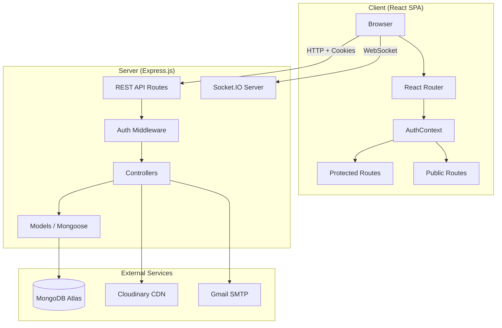
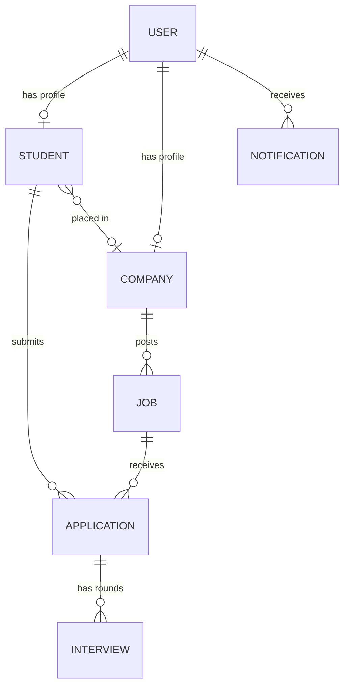
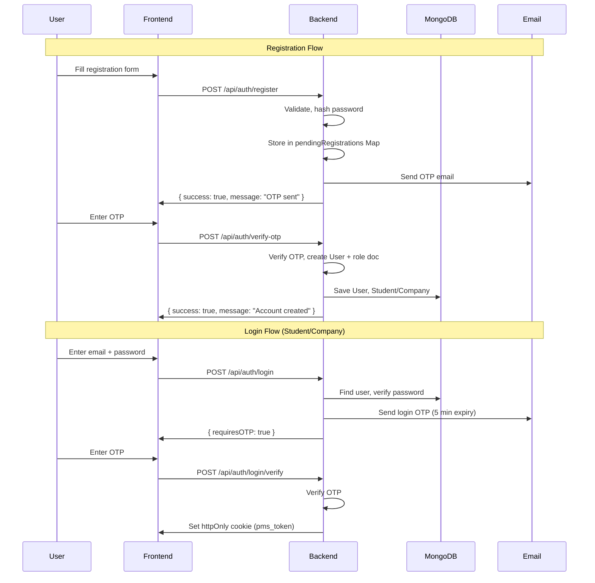

# Placement Management System (PMS) — System Master Report

**Version:** 2.0  
**Date:** April 2026  
**Prepared for:** Viva Examination  
**Technology Stack:** MERN (MongoDB, Express.js, React, Node.js)

---

## Table of Contents

1. [Project Overview](#1-project-overview)
2. [System Architecture](#2-system-architecture)
3. [Technology Stack & Dependencies](#3-technology-stack--dependencies)
4. [Database Design](#4-database-design)
5. [Authentication & Security](#5-authentication--security)
6. [API Reference](#6-api-reference)
7. [Frontend Architecture](#7-frontend-architecture)
8. [Role-Based Access Control](#8-role-based-access-control)
9. [Key Features & Modules](#9-key-features--modules)
10. [Real-Time Features](#10-real-time-features)
11. [File Storage & Cloudinary Integration](#11-file-storage--cloudinary-integration)
12. [Email Service](#12-email-service)
13. [System Settings & Configuration](#13-system-settings--configuration)
14. [Design System & UI](#14-design-system--ui)
15. [Deployment Considerations](#15-deployment-considerations)
16. [Future Enhancements](#16-future-enhancements)

---

## 1. Project Overview

### 1.1 Problem Statement
Campus placement processes in universities are traditionally managed manually through spreadsheets, emails, and bulletin boards. This leads to inefficiency, data duplication, missed deadlines, and lack of transparency for students, companies, and placement officers.

### 1.2 Proposed Solution
The Placement Management System (PMS) is a full-stack web application that digitizes and automates the entire campus placement lifecycle. It provides role-based dashboards for three user types — **Students**, **Companies**, and **Administrators** — to manage job postings, applications, interview scheduling, offer management, and placement reporting in a single unified platform.

### 1.3 Core Objectives
| Objective | Implementation |
|-----------|---------------|
| Eliminate manual tracking | Automated application status tracking with real-time notifications |
| Ensure transparency | Students can track every application stage (applied → shortlisted → interview → selected) |
| Enforce eligibility rules | Server-side validation of CGPA, backlog, branch eligibility before every application |
| Data integrity | Academic verification by admin; verified records are locked from student editing |
| Multi-stakeholder access | Role-based dashboards for students, companies, and administrators |
| Real-time communication | Socket.IO notifications, automated interview reminders via email |
| Cloud-ready deployment | All file storage via Cloudinary; environment-variable-driven configuration |

### 1.4 Scope
- Student registration, profile management, job applications, offer handling
- Company registration, approval workflow, job posting, applicant management, interview scheduling
- Admin oversight: user management, academic verification, placement reports, global settings
- Public landing page with dynamic stats, top recruiters, and a contact form

---

## 2. System Architecture

### 2.1 High-Level Architecture



### 2.2 Directory Structure

```
PMSv2/
├── .env                        # Environment variables (secrets)
├── package.json                # Server dependencies
├── server/
│   ├── server.js               # Express app entry point + Socket.IO init
│   ├── config/
│   │   ├── db.js               # MongoDB connection
│   │   └── validateEnv.js      # Environment variable validation
│   ├── controllers/
│   │   ├── authController.js   # Register, login, OTP, password reset
│   │   ├── studentController.js # Student CRUD, jobs, applications, offers
│   │   ├── companyController.js # Company CRUD, jobs, applicants, interviews
│   │   ├── adminController.js  # Admin oversight, reports, user management
│   │   ├── publicController.js # Public stats, companies, contact form
│   │   └── settingsController.js # System settings CRUD
│   ├── middleware/
│   │   ├── authMiddleware.js   # JWT verification, role authorization
│   │   ├── rateLimiter.js      # Rate limiting for auth endpoints
│   │   └── upload.js           # Multer + Cloudinary storage configs
│   ├── models/
│   │   ├── User.js             # Base user (name, email, role, auth fields)
│   │   ├── Student.js          # Student profile (academic, skills, placement)
│   │   ├── Company.js          # Company profile (details, logo, approval)
│   │   ├── Job.js              # Job postings (requirements, eligibility)
│   │   ├── Application.js      # Student-job applications (status, offers)
│   │   ├── Interview.js        # Interview rounds (scheduling, results)
│   │   ├── Notification.js     # In-app notifications (TTL: 90 days)
│   │   ├── PlacementReport.js  # Generated placement reports
│   │   └── SystemSettings.js   # Singleton config document
│   ├── routes/
│   │   ├── authRoutes.js       # /api/auth/*
│   │   ├── studentRoutes.js    # /api/student/*
│   │   ├── companyRoutes.js    # /api/company/*
│   │   ├── adminRoutes.js      # /api/admin/*
│   │   ├── publicRoutes.js     # /api/public/* (no auth required)
│   │   └── notificationRoutes.js
│   ├── services/
│   │   ├── emailService.js     # Nodemailer (OTP, contact form)
│   │   ├── otpService.js       # OTP generation, hashing, verification
│   │   ├── socketService.js    # Socket.IO initialization
│   │   └── interviewReminder.js # Cron-style interview reminder emails
│   └── utils/
│       ├── apiResponse.js      # Standardized { success, message, data }
│       ├── constants.js        # SKILLS_LIST enum
│       └── seedAdmin.js        # Admin user seeder script
│
├── client/
│   ├── package.json            # Frontend dependencies
│   ├── vite.config.js          # Vite build config
│   ├── index.html
│   └── src/
│       ├── main.jsx            # React entry (BrowserRouter + AuthProvider)
│       ├── App.jsx             # Route definitions
│       ├── index.css           # Global styles + Bauhaus design tokens
│       ├── context/
│       │   └── AuthContext.jsx # Global auth state, socket management
│       ├── services/
│       │   └── api.js          # Axios instance + 401 interceptor
│       ├── data/
│       │   └── landingData.js  # Static landing page data
│       ├── pages/
│       │   ├── LandingPage.jsx # Public landing page
│       │   ├── ContactUs.jsx   # Public contact form
│       │   ├── NotFound.jsx    # 404 page
│       │   └── Unauthorized.jsx
│       └── components/
│           ├── auth/           # Login, Register, VerifyOTP
│           ├── common/         # Navbar, Sidebar, Loader, ResumeViewer, etc.
│           ├── student/        # StudentDashboard, Profile, JobList, etc.
│           ├── company/        # CompanyDashboard, Profile, PostJob, etc.
│           └── admin/          # AdminDashboard, ManageStudents, Reports, etc.
```

---

## 3. Technology Stack & Dependencies

### 3.1 Backend

| Package | Version | Purpose |
|---------|---------|---------|
| express | 4.18.x | HTTP server framework |
| mongoose | 8.1.x | MongoDB ODM with schema validation |
| bcryptjs | 2.4.x | Password hashing (salt rounds: 12) |
| jsonwebtoken | 9.0.x | JWT generation and verification |
| nodemailer | 6.9.x | Email sending (Gmail SMTP) |
| multer | 1.4.x | File upload parsing |
| multer-storage-cloudinary | 4.0.x | Direct Cloudinary upload from multer |
| cloudinary | 1.41.x | Cloud image/file storage |
| helmet | 7.1.x | Security headers |
| cors | 2.8.x | Cross-origin resource sharing |
| express-mongo-sanitize | 2.2.x | NoSQL injection prevention |
| xss-clean | 0.1.x | XSS protection |
| express-rate-limit | 7.1.x | Rate limiting for auth endpoints |
| socket.io | 4.8.x | Real-time WebSocket communication |
| cookie-parser | 1.4.x | HTTP cookie parsing |
| express-validator | 7.0.x | Request body validation |
| dotenv | 16.4.x | Environment variable loading |

### 3.2 Frontend

| Package | Purpose |
|---------|---------|
| React 18 | UI library with hooks |
| React Router DOM 6 | Client-side routing |
| Axios | HTTP client with interceptors |
| Lucide React | Icon library |
| Vite | Build tool and dev server |
| TailwindCSS | Utility-first CSS framework |

### 3.3 External Services

| Service | Purpose |
|---------|---------|
| MongoDB Atlas | Cloud-hosted database |
| Cloudinary | Image/PDF storage CDN |
| Gmail SMTP | Transactional email (OTPs, notifications, contact form) |
| Logo.dev | Dynamic company logo retrieval via Search API |

---

## 4. Database Design

### 4.1 Entity-Relationship Overview



### 4.2 Model Schemas

#### User Model
| Field | Type | Description |
|-------|------|-------------|
| name | String (required) | User's display name |
| email | String (unique, required) | Login identifier |
| password | String (select: false) | bcrypt-hashed password |
| role | Enum: student, company, admin | Access control role |
| isVerified | Boolean | Email verification status |
| isActive | Boolean | Account active/suspended |
| profileCompleted | Boolean | Profile completion flag |
| profileImageUrl | String | Cloudinary profile image URL |
| otp, otpExpiry, otpAttempts | Mixed | OTP lifecycle fields |
| otpVerifiedForReset | Boolean | Password reset OTP gate |

**Indexes:** `{ email: 1 }` (unique), `{ role: 1, isActive: 1 }` (compound)

#### Student Model
| Field | Type | Description |
|-------|------|-------------|
| user | ObjectId → User | Foreign key (unique) |
| enrollmentNo | String (unique, sparse) | University enrollment number |
| branch | Enum: CSE, IT, ECE, EE, ME, CE, Other | Academic branch |
| cgpa | Number (0–10) | Current CGPA |
| tenthPercentage, twelfthPercentage | Number (0–100) | Board exam scores |
| activeBacklogs | Number | Active backlogs count |
| skills | [String] | Validated against SKILLS_LIST |
| projects, certifications | [SubDoc] | Nested arrays |
| resumeUrl | String | Cloudinary resume PDF URL |
| profilePicture | { url, publicId } | Cloudinary image reference |
| placementStatus | Enum: placed, unplaced | Current placement state |
| placedIn | ObjectId → Company | Which company placed the student |
| academicVerified | Boolean | Admin verification flag |

**Key Indexes:** `{ cgpa: 1, branch: 1, activeBacklogs: 1 }` (eligibility), `{ placementStatus: 1 }`, `{ passingYear: 1 }`

#### Company Model
| Field | Type | Description |
|-------|------|-------------|
| user | ObjectId → User | Foreign key (unique) |
| name | String (required) | Company name |
| industry, location, website | String | Company details |
| tier | Enum: tier1, tier2, mass_recruiter | Recruitment tier |
| hrName, hrEmail, hrPhone | String | HR contact |
| logo | { url, publicId } | Cloudinary logo reference |
| isApproved | Boolean | Admin approval status |

#### Job Model
| Field | Type | Description |
|-------|------|-------------|
| company | ObjectId → Company | Posting company |
| title, description | String | Job details |
| requiredSkills | [String] | Skills from SKILLS_LIST |
| package, stipend | String | Compensation |
| jobType | Enum: fulltime, internship | Job category |
| minCGPA | Number (0-10) | Minimum CGPA requirement |
| maxBacklogs | Number | Maximum allowed backlogs |
| eligibleBranches | [String] | Eligible branches |
| openings | Number | Number of positions |
| deadline | Date | Application deadline |
| status | Enum: open, closed, draft | Current state |

**Key Indexes:** `{ status: 1, minCGPA: 1 }`, `{ eligibleBranches: 1 }` (multikey), `{ createdAt: -1 }`

#### Application Model
| Field | Type | Description |
|-------|------|-------------|
| student | ObjectId → Student | Applicant |
| job | ObjectId → Job | Target job |
| company | ObjectId → Company | Target company |
| status | Enum: applied, shortlisted, interview, selected, rejected, withdrawn | Pipeline stage |
| offerStatus | Enum: pending, accepted, declined, revoked | Offer response |
| offeredPackage | String | CTC offered |
| offerLetterUrl | String | Offer letter document URL |

**Critical Index:** `{ student: 1, job: 1 }` (unique compound — prevents duplicate applications)

#### Interview Model
| Field | Type | Description |
|-------|------|-------------|
| application, student, company, job | ObjectId | References |
| roundName | String | e.g., "Technical Round 1" |
| roundNumber | Number | Sequential round number |
| scheduledAt | Date | Interview date/time |
| mode | Enum: online, offline | Interview mode |
| venue / meetingLink | String | Location details |
| status | Enum: scheduled, completed, cancelled | Round status |
| result | Enum: pass, fail, pending | Round outcome |

#### SystemSettings Model (Singleton)
| Field | Type | Default | Description |
|-------|------|---------|-------------|
| placementSeasonActive | Boolean | true | Master switch for applications |
| blockPlacedFromApplying | Boolean | true | Block placed students |
| allowMultipleOffers | Boolean | false | Allow multiple accepted offers |
| maxApplicationsPerStudent | Number | 0 (unlimited) | Application cap |
| minCGPAOverride | Number | 0 | Global min CGPA floor |
| logoUrl | String | Google logo URL | Platform logo (web URL only) |
| companyName | String | "PMS" | Institution name |
| contactEmail | String | admin@pms.com | Contact Us recipient |
| phone, address | String | "" | Contact details |

---

## 5. Authentication & Security

### 5.1 Authentication Flow



### 5.2 Security Measures

| Measure | Implementation |
|---------|---------------|
| Password hashing | bcrypt with 12 salt rounds |
| JWT storage | httpOnly, secure, sameSite: 'strict' cookie |
| OTP security | bcrypt-hashed OTPs stored temporarily; 5-attempt lockout |
| Registration security | User docs created only AFTER OTP verification (in-memory pending map) |
| CORS | Locked to single CLIENT_URL (no wildcards) |
| NoSQL injection | express-mongo-sanitize middleware |
| XSS prevention | xss-clean middleware |
| Security headers | Helmet.js (Content-Security-Policy, X-Frame-Options, etc.) |
| Rate limiting | Separate limits for auth, OTP, and resend endpoints |
| Admin bypass (dev only) | OTP bypass with magic code — disabled in production |
| Input validation | express-validator on all mutation routes |

### 5.3 JWT Implementation
```javascript
// Token generation
const token = jwt.sign({ id: userId }, process.env.JWT_SECRET, {
  expiresIn: process.env.JWT_EXPIRES_IN // "7d"
});

// Cookie settings
res.cookie('pms_token', token, {
  httpOnly: true,           // Not accessible via JavaScript
  secure: isProduction,     // HTTPS only in production
  sameSite: 'strict',       // CSRF protection
  maxAge: 7 * 24 * 60 * 60 * 1000  // 7 days
});
```

---

## 6. API Reference

### 6.1 Authentication (`/api/auth`)
| Method | Endpoint | Auth | Description |
|--------|----------|------|-------------|
| POST | /register | No | Register new user (sends OTP) |
| POST | /verify-otp | No | Verify registration OTP → create account |
| POST | /login | No | Login step 1 (verify credentials, send OTP) |
| POST | /login/verify | No | Login step 2 (verify login OTP) |
| POST | /logout | Yes | Clear auth cookie |
| POST | /resend-otp | No | Resend OTP for registration/login/reset |
| POST | /forgot-password | No | Send password reset OTP |
| POST | /verify-reset-otp | No | Verify reset OTP |
| POST | /reset-password | No | Set new password |
| GET | /me | Yes | Get current authenticated user |

### 6.2 Student (`/api/student`) — Requires `student` role
| Method | Endpoint | Description |
|--------|----------|-------------|
| GET | /dashboard | Dashboard stats + completion score |
| GET | /profile | Get full student profile |
| PUT | /profile | Update profile (personal + academic) |
| POST | /profile/picture | Upload profile picture to Cloudinary |
| POST | /resume | Upload resume PDF to Cloudinary |
| GET | /jobs | Get eligible jobs (with skill match scores) |
| POST | /apply/:jobId | Apply to a job (eligibility re-checked server-side) |
| GET | /applications | Get all applications |
| PUT | /applications/:id/withdraw | Withdraw application |
| GET | /interviews | Get interview schedule |
| GET | /offers | Get all offers (status: selected) |
| PUT | /applications/:id/offer | Accept or decline an offer |

### 6.3 Company (`/api/company`) — Requires `company` role
| Method | Endpoint | Description |
|--------|----------|-------------|
| GET | /dashboard | Company dashboard stats |
| GET/PUT | /profile | Get/update company profile |
| POST | /profile/logo | Upload company logo |
| POST | /jobs | Post a new job (auto-notifies eligible students) |
| GET | /jobs | Get company's jobs |
| GET | /jobs/:id | Get single job details |
| PUT | /jobs/:id | Update job details |
| PATCH | /jobs/:id/status | Toggle job open/closed (bulk rejects on close) |
| GET | /jobs/:id/applicants | Get applicants for a job (paginated) |
| GET | /jobs/:id/export | Export applicants as CSV |
| PUT | /applications/:id/status | Update application status |
| POST | /interviews | Schedule interview round |
| PUT | /interviews/:id/result | Submit round result (auto-rejects on fail) |

### 6.4 Admin (`/api/admin`) — Requires `admin` role
| Method | Endpoint | Description |
|--------|----------|-------------|
| GET | /dashboard | System-wide stats |
| GET | /students | List all students (paginated, filterable) |
| PUT | /students/:id/verify | Toggle academic verification |
| DELETE | /students/:id | Delete student + Cloudinary cleanup |
| GET | /companies | List all companies |
| PUT | /companies/:id/approve | Toggle company approval |
| DELETE | /companies/:id | Delete company + cascade cleanup |
| GET | /jobs | List all jobs |
| POST | /reports/generate | Generate placement report |
| GET/PUT | /settings | System settings CRUD |

### 6.5 Public (`/api/public`) — No authentication
| Method | Endpoint | Description |
|--------|----------|-------------|
| GET | /stats | Landing page stats |
| GET | /companies | Approved companies list |
| GET | /jobs | Open job listings |
| GET | /skills | Predefined skills list |
| GET | /settings | Public contact info + logo URL |
| POST | /contact | Contact form submission (sends email) |

### 6.6 Utility
| Method | Endpoint | Auth | Description |
|--------|----------|------|-------------|
| GET | /api/health | No | Health check |
| GET | /api/pdf-proxy?url=... | No | PDF proxy for inline viewing |

---

## 7. Frontend Architecture

### 7.1 State Management
- **AuthContext** — Global auth state via React Context API
  - Stores: `user`, `isAuthenticated`, `loading`, `unreadCount`
  - Methods: `login()`, `logout()`, `checkAuth()`, `verifyOTP()`, `loginVerify()`, `register()`
  - Socket.IO connection lifecycle management
  - Checks `/api/auth/me` on mount to restore session from httpOnly cookie

### 7.2 Routing Architecture
```
/                       → LandingPage (public, always accessible)
/contact                → ContactUs (public, own nav)
/login                  → Login
/register               → Register  
/verify-otp             → VerifyOTP (registration/login/reset)

/student/dashboard      → ProtectedRoute(student) → StudentDashboard
/student/profile        → ProtectedRoute(student) → StudentProfile
/student/jobs           → ProtectedRoute(student) → JobList
/student/applications   → ProtectedRoute(student) → ApplicationTracker
/student/interviews     → ProtectedRoute(student) → InterviewSchedule

/company/dashboard      → ProtectedRoute(company) → CompanyDashboard
/company/profile        → ProtectedRoute(company) → CompanyProfile
/company/post-job       → ProtectedRoute(company) → PostJob
/company/jobs           → ProtectedRoute(company) → CompanyJobList
/company/jobs/:id       → ProtectedRoute(company) → JobDetails
/company/jobs/:id/edit  → ProtectedRoute(company) → EditJob

/admin/dashboard        → ProtectedRoute(admin) → AdminDashboard
/admin/students         → ProtectedRoute(admin) → ManageStudents
/admin/companies        → ProtectedRoute(admin) → ManageCompanies
/admin/settings         → ProtectedRoute(admin) → PlacementSettings
```

### 7.3 Navigation Flow (Task 5 Fix)
| Action | Result |
|--------|--------|
| Click PMS logo | Always navigates to landing page ("/") |
| Click "Home" button | Navigates to landing page ("/") |
| Click user avatar | Navigates to role-specific dashboard |
| Logout | Redirects to landing page ("/") |
| Landing page (authenticated) | Shows "Go to Dashboard" button |
| Landing page (unauthenticated) | Shows "Get Started" / "Login" buttons |

---

## 8. Role-Based Access Control

### 8.1 RBAC Matrix

| Feature | Student | Company | Admin |
|---------|---------|---------|-------|
| View/edit own profile | ✅ | ✅ | ✅ |
| Browse eligible jobs | ✅ | ❌ | ❌ |
| Apply to jobs | ✅ | ❌ | ❌ |
| Accept/decline offers | ✅ | ❌ | ❌ |
| Post jobs | ❌ | ✅ | ❌ |
| Review applicants | ❌ | ✅ | ✅ |
| Schedule interviews | ❌ | ✅ | ❌ |
| Export CSV | ❌ | ✅ | ✅ |
| Approve companies | ❌ | ❌ | ✅ |
| Verify academics | ❌ | ❌ | ✅ |
| Delete users | ❌ | ❌ | ✅ |
| Manage settings | ❌ | ❌ | ✅ |
| Generate reports | ❌ | ❌ | ✅ |

### 8.2 Implementation
```javascript
// Backend middleware
const authorize = (...roles) => (req, res, next) => {
  if (!roles.includes(req.user.role)) {
    return res.status(403).json({ message: 'Not authorized' });
  }
  next();
};

// Frontend route protection
<ProtectedRoute allowedRoles={['student']}>
  <StudentDashboard />
</ProtectedRoute>
```

---

## 9. Key Features & Modules

### 9.1 Smart Job Matching (Student)
- Server-side eligibility filtering: CGPA ≥ minCGPA, backlogs ≤ maxBacklogs, branch ∈ eligibleBranches
- Skill match scoring: `matchScore = (matchedSkills / requiredSkills) × 100`
- Match levels: `strong` (≥3 matches), `partial` (≥1), `none` (0)
- Jobs sorted by match level then score descending

### 9.2 Application Pipeline
```
applied → shortlisted → interview → selected → [accepted/declined]
                                   → rejected
applied → withdrawn (by student)
```
- Duplicate prevention via unique compound index `{ student, job }`
- Profile completion gate: all personal + academic fields required before applying
- Academic verification gate: must be admin-verified before first application

### 9.3 Interview Management
- Multi-round scheduling with sequential round numbers
- Automatic rejection on round failure (cancels remaining rounds)
- Auto-cancel all scheduled interviews when application is withdrawn or rejected
- Auto-cancel all interviews when a job is closed
- Automated email reminders 24 hours before scheduled interviews

### 9.4 Offer Management
- Single offer acceptance enforced (unless allowMultipleOffers enabled)
- Student placementStatus → 'placed' on offer acceptance
- Placement reverted on offer decline (if no other accepted offers)
- Company notified on accept/decline

### 9.5 Admin Academic Verification
- Students cannot apply until `academicVerified: true`
- Once verified, academic fields (CGPA, enrollment, etc.) are locked from student editing
- Only admin can toggle verification on/off

### 9.6 Global Placement Settings
| Setting | Effect |
|---------|--------|
| placementSeasonActive | Master switch — blocks all new applications when false |
| blockPlacedFromApplying | Prevents placed students from applying again |
| maxApplicationsPerStudent | Caps active applications (0 = unlimited) |
| minCGPAOverride | Global CGPA floor (overrides job-level if higher) |
| allowMultipleOffers | Allows holding multiple accepted offers |

---

## 10. Real-Time Features

### 10.1 Socket.IO Integration
- Initialized in `server.js` alongside HTTP server
- CORS locked to CLIENT_URL
- User rooms: each authenticated user joins a room named by their user ID
- Events: `new_notification`, `notification_count`

### 10.2 Notification System
- 6 notification types: `job_posted`, `application_update`, `interview_scheduled`, `offer_received`, `announcement`, `security`
- In-app bell notification with unread count badge
- TTL index: auto-deletes notifications older than 90 days
- Pagination + mark as read functionality

### 10.3 Interview Reminders
- Background job runs every 30 minutes
- Sends email reminders 24 hours before scheduled interviews
- Includes interview details: round name, company, date/time, mode, venue/link

---

## 11. File Storage & Cloudinary Integration

### 11.1 Storage Configuration
| Resource | Folder | Type | Max Size | Transforms |
|----------|--------|------|----------|------------|
| Resume | pms-resumes | raw (PDF) | 5MB | None |
| Profile Picture | pms-profile-pictures | image | 2MB | 400×400, face-crop |
| Company Logo | pms-company-logos | image | 2MB | 300×300, pad (white) |

### 11.2 Cleanup Strategy
- Old files deleted from Cloudinary before uploading replacements
- Admin user deletion cascades: delete profile pictures, logos, resumes from Cloudinary
- `deleteCloudinaryFile(url)` — URL-based deletion for resumes
- `deleteFromCloudinary(publicId, resourceType)` — publicId-based deletion for images

### 11.3 PDF Inline Viewing (Task 1 Fix)
**Problem:** Cloudinary stores resumes as `resource_type: 'raw'`, serving with `Content-Type: application/octet-stream`. This causes browsers to download as `.file` instead of displaying inline.

**Solution:** Centralized Backend Proxy Flow:
1. Backend proxy route `/api/pdf-proxy?url=<any_url>` fetches the document.
2. Re-serves with `Content-Type: application/pdf`, `Content-Length`, and `Content-Disposition: inline`.
3. Frontend uses a shared `getPdfProxyUrl()` helper function in `services/api.js` (uses VITE_API_URL).
4. `ResumeViewer.jsx` and `ManageStudents.jsx` use this proxy URL for iframe `src` and direct links.
5. Google Docs viewer operates as a fallback if the iframe fails.

---

## 12. Email Service

### 12.1 Configuration
- Transport: Gmail SMTP via Nodemailer
- Credentials: `EMAIL_USER` / `EMAIL_PASS` (App Password)
- From: `"PMS - Placement Management System" <email@gmail.com>`

### 12.2 Email Types
| Email | Trigger | Recipient |
|-------|---------|-----------|
| Registration OTP | POST /auth/register | New user |
| Login OTP | POST /auth/login | Existing user |
| Password Reset OTP | POST /auth/forgot-password | User |
| Interview Reminder | Automated (24h before) | Student |
| Contact Form | POST /public/contact | Admin (contactEmail) |
| Contact Auto-Reply | POST /public/contact | Form submitter |

---

## 13. System Settings & Configuration

### 13.1 Environment Variables
| Variable | Required | Description |
|----------|----------|-------------|
| PORT | Yes | Server port (default: 5000) |
| NODE_ENV | Yes | development / production |
| MONGO_URI | Yes | MongoDB Atlas connection string |
| JWT_SECRET | Yes | JWT signing secret |
| JWT_EXPIRES_IN | Yes | JWT lifetime (e.g., "7d") |
| EMAIL_USER | Yes | Gmail address for SMTP |
| EMAIL_PASS | Yes | Gmail App Password |
| CLIENT_URL | Yes | Frontend URL for CORS |
| CLOUDINARY_CLOUD_NAME | Yes | Cloudinary cloud name |
| CLOUDINARY_API_KEY | Yes | Cloudinary API key |
| CLOUDINARY_API_SECRET | Yes | Cloudinary API secret |
| BYPASS_OTP | Dev only | Skip OTP in development |
| BYPASS_OTP_CODE | Dev only | Magic OTP code for dev |

### 13.2 Legacy Branding Configuration (Admin Settings)
- **Status:** The explicit "Branding & Logo" configuration section has been entirely **removed from the Admin UI** per recent updates.
- **Backend Persistence:** The `SystemSettings` collections still retain `logoUrl` and `companyName` logically, but the UI component is intentionally hidden to prevent admins from breaking platform aesthetic logic manually.

### 13.3 Dynamic Company Logos (Logo.dev Integration)
- **Implementation:** Custom reusable `<CompanyLogo />` component.
- **API Cache:** Utilizes an in-memory `domainCache` to prevent redundant `/search` queries.
- **Auth:** Secured via `VITE_LOGO_DEV_SECRET` appended as an `Authorization: Bearer` header on front-end fetch calls to `api.logo.dev`.
- **Fallback:** Seamlessly defaults to a Bauhaus-styled letter monogram if the API fails or no domain matches.
- **Usage:** Replaced static image links in both `landingData.js` and the dynamic backend `/public/companies` feeds.

---

## 14. Design System & UI

### 14.1 Bauhaus Design System
The application follows a strict Bauhaus-inspired design language:

| Token | Value | Usage |
|-------|-------|-------|
| `bauhaus-black` | #1a1a2e | Primary text, borders, backgrounds |
| `bauhaus-red` | #e63946 | Primary action, danger, CTAs |
| `bauhaus-blue` | #1a56db | Secondary actions, links, info |
| `bauhaus-yellow` | #f4d03f | Accents, highlights, success |
| `bauhaus-white` | #fafaf5 | Page background |
| `bauhaus-muted` | #f0efe6 | Low-contrast backgrounds |
| Font | Inter / system-ui | Clean, geometric sans-serif |

### 14.2 UI Patterns
- **Border:** 4px solid black borders on cards
- **Shadow:** `shadow-hard` (offset solid shadows for depth)
- **Typography:** All-caps, extra-bold, wide tracking for labels
- **Geometric accents:** Red circles, blue squares, yellow triangles
- **Interactions:** Active states with translate + shadow removal

---

## 15. Deployment Considerations

### 15.1 Pre-Deployment Checklist
- [ ] Set `NODE_ENV=production`
- [ ] Generate strong JWT_SECRET
- [ ] Configure production MONGO_URI (Atlas with IP whitelist)
- [ ] Set CLIENT_URL to production frontend URL
- [ ] Verify all Cloudinary credentials
- [ ] Run `node server/utils/seedAdmin.js` to create admin user
- [ ] Ensure `BYPASS_OTP` is NOT set in production

### 15.2 Database Indexes
All indexes are defined in model files using Mongoose schema methods. They are auto-created on first connection. Key performance indexes:
- `Application: { student: 1, job: 1 }` (unique — critical for data integrity)
- `Student: { cgpa: 1, branch: 1, activeBacklogs: 1 }` (eligibility queries)
- `Notification: { createdAt: 1 }` (TTL: 90 days auto-cleanup)

---

## 16. Future Enhancements

| Enhancement | Description |
|-------------|-------------|
| Resume Parser | Auto-extract skills from uploaded PDF resumes using NLP |
| Company Analytics Dashboard | Visualize hiring funnel, conversion rates, time-to-hire |
| Bulk Operations | Admin bulk-verify students, bulk-approve companies |
| Export to Excel | Student placement data export with formatting |
| Mobile App | React Native companion app for interview notifications |
| Alumni Integration | Connect with placed alumni for mentoring |
| AI Job Recommendations | ML-based job recommendations beyond skill matching |
| Multi-tenant | Support multiple universities on a single deployment |

---

*This report provides a comprehensive overview of the Placement Management System for the purpose of viva examination. All technical details, design decisions, and implementation specifics are documented above.*
