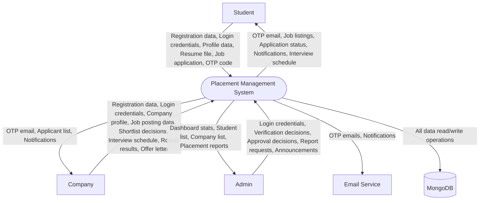
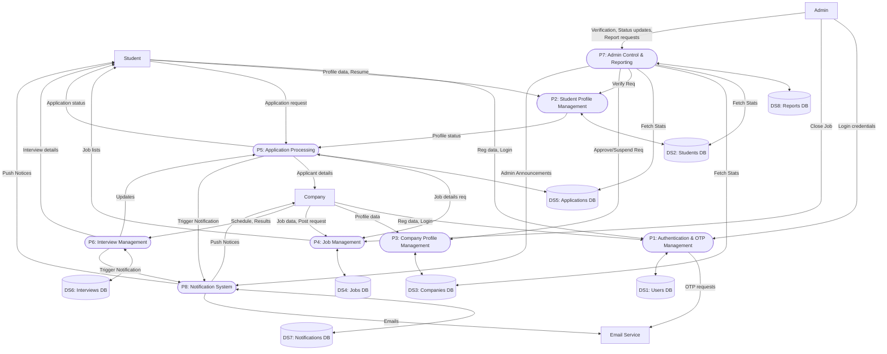
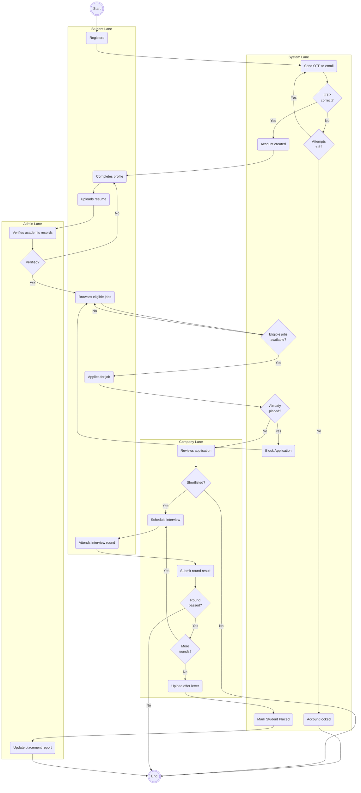
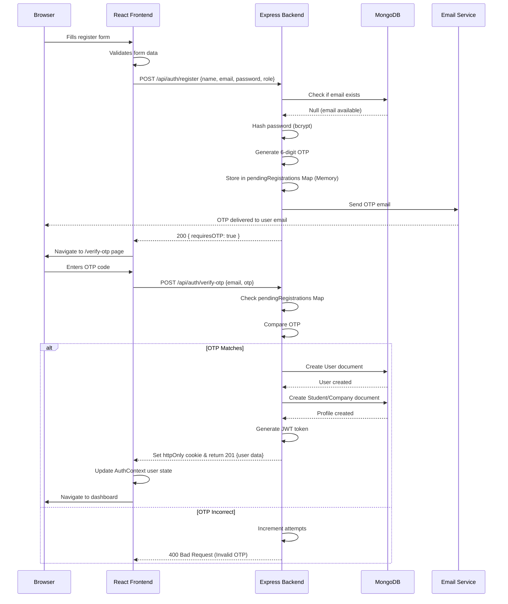
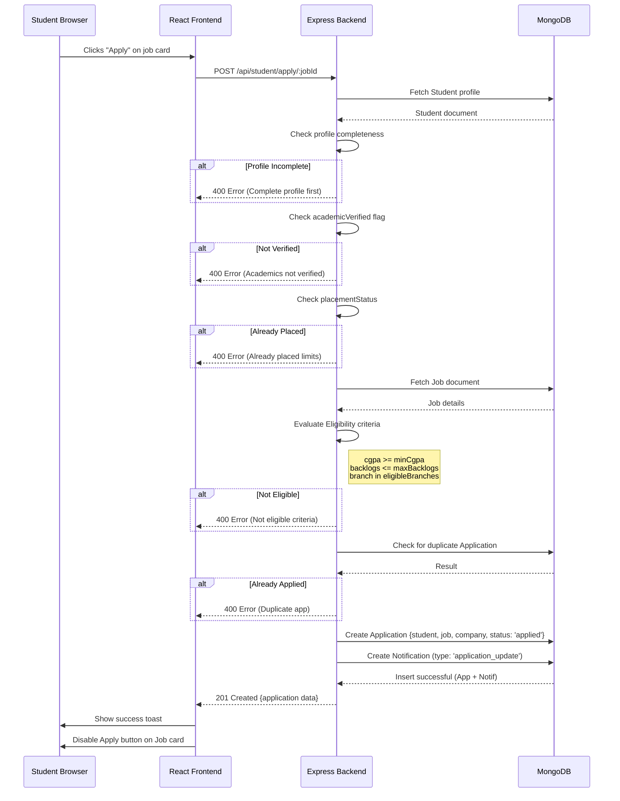

# PMS — Software Design Diagrams
## Project: Placement Management System
## Generated: 2026-04-18

---

## 1. Use Case Diagram
This use case diagram illustrates the interactions between the main actors (Student, Company, Admin, and the automated System) and the Placement Management System. It highlights system boundaries, actor permissions, and shared processes using `<<include>>` and `<<extend>>` relationships.

```mermaid
usecaseDiagram
    actor Student
    actor Company
    actor Admin
    actor System as "System (Automated)"

    package "Placement Management System (PMS)" {
        
        %% Student Use Cases
        usecase "Register account" as UC_S1
        usecase "Login with OTP" as UC_S2
        usecase "Complete profile" as UC_S3
        usecase "Upload resume" as UC_S4
        usecase "Browse eligible jobs" as UC_S5
        usecase "Apply to job" as UC_S6
        usecase "Track application" as UC_S7
        usecase "View interview schedule" as UC_S8
        usecase "View notifications" as UC_S9
        usecase "Logout" as UC_S10

        %% Company Use Cases
        usecase "Complete company profile" as UC_C1
        usecase "Post job" as UC_C2
        usecase "View applicants" as UC_C3
        usecase "Shortlist applicant" as UC_C4
        usecase "Schedule interview" as UC_C5
        usecase "Submit round result" as UC_C6
        usecase "Select candidate" as UC_C7
        usecase "Upload offer letter" as UC_C8

        %% Admin Use Cases
        usecase "Login (direct, no OTP)" as UC_A1
        usecase "View dashboard" as UC_A2
        usecase "Verify student academics" as UC_A3
        usecase "Suspend/unsuspend student" as UC_A4
        usecase "Delete student" as UC_A5
        usecase "Approve company" as UC_A6
        usecase "Reject company" as UC_A7
        usecase "Suspend company" as UC_A8
        usecase "Delete company" as UC_A9
        usecase "Close job" as UC_A10
        usecase "Send announcement" as UC_A11
        usecase "Generate placement report" as UC_A12

        %% System / Shared Use Cases
        usecase "Verify OTP (email)" as UC_SYS1
        usecase "Send OTP email" as UC_SYS2
        usecase "Check job eligibility" as UC_SYS3
        usecase "Calculate skill match score" as UC_SYS4
        usecase "Send notifications" as UC_SYS5
        usecase "Generate placement stats" as UC_SYS6
    }

    Student --> UC_S1
    Student --> UC_S2
    Student --> UC_S3
    Student --> UC_S4
    Student --> UC_S5
    Student --> UC_S6
    Student --> UC_S7
    Student --> UC_S8
    Student --> UC_S9
    Student --> UC_S10

    Company --> UC_S1 : "Register"
    Company --> UC_S2 : "Login"
    Company --> UC_C1
    Company --> UC_C2
    Company --> UC_C3
    Company --> UC_C4
    Company --> UC_C5
    Company --> UC_C6
    Company --> UC_C7
    Company --> UC_C8
    Company --> UC_S10 : "Logout"

    Admin --> UC_A1
    Admin --> UC_A2
    Admin --> UC_A3
    Admin --> UC_A4
    Admin --> UC_A5
    Admin --> UC_A6
    Admin --> UC_A7
    Admin --> UC_A8
    Admin --> UC_A9
    Admin --> UC_A10
    Admin --> UC_A11
    Admin --> UC_A12
    Admin --> UC_S10 : "Logout"

    System --> UC_SYS2
    System --> UC_SYS3
    System --> UC_SYS4
    System --> UC_SYS5
    System --> UC_SYS6

    %% Includes & Extends
    UC_S1 ..> UC_SYS1 : <<include>>
    UC_S2 ..> UC_SYS1 : <<include>>
    UC_SYS1 ..> UC_SYS2 : <<include>>
    
    UC_S6 ..> UC_SYS3 : <<include>>
    UC_S5 <.. UC_SYS4 : <<extend>>
    UC_S5 <.. UC_SYS3 : <<extend>>
    UC_A12 ..> UC_SYS6 : <<include>>
    
    UC_A11 ..> UC_SYS5 : <<include>>
    UC_C5 ..> UC_SYS5 : <<include>>
    UC_C8 ..> UC_SYS5 : <<include>>
```

---

## 2. DFD Level 0 — Context Diagram
This diagram shows the complete system as a single black box, identifying all external entities and the major data flows going into and coming out of the system.



---

## 3. DFD Level 1
This level 1 Data Flow Diagram breaks down the main system into 8 primary interconnected processes. It illustrates how these processes interact with each other, the external entities, and the 8 main data stores.



---

## 4. DFD Level 2 — Application Processing
This level 2 DFD decomposes Process 5 (Application Processing) into its precise internal sub-processes, mapping out the systematic evaluation of student eligibility and eventual application storage.

```mermaid
flowchart TD
    %% Source Ext
    Student[Student]
    Company[Company]
    
    %% Relevant Data Stores
    DS2[(DS2: Students DB)]
    DS4[(DS4: Jobs DB)]
    DS5[(DS5: Applications DB)]
    
    %% Sub-processes of P5
    P5_1([P5.1: Check Profile Completeness])
    P5_2([P5.2: Check Academic Verification])
    P5_3([P5.3: Check Placement Status])
    P5_4([P5.4: Check Job Eligibility])
    P5_5([P5.5: Create Application Record])
    P5_6([P5.6: Update Application Status])
    P5_7([P5.7: Process Round Results])
    P5_8([P5.8: Process Final Selection])
    P5_9([P5.9: Update Placement Status])

    %% Flows
    Student -- Job Application Request --> P5_1
    P5_1 -- Query Profile Data --> DS2
    DS2 -- Student Profile Data --> P5_1
    P5_1 -- Valid Profile --> P5_2
    
    P5_2 -- Verify Academic Flag --> DS2
    P5_2 -- Verified Academics --> P5_3
    
    P5_3 -- Check "placed" flag --> DS2
    P5_3 -- Unplaced --> P5_4
    
    P5_4 -- Query Job details --> DS4
    DS4 -- Job Criteria --> P5_4
    P5_4 -- Validate CGPA/Branch/\nBacklogs --> P5_5
    
    P5_5 -- Generate new App --> DS5
    P5_5 -- Application Confirm --> Student
    P5_5 -- New Applicant --> Company
    
    Company -- Round Status Updates --> P5_6
    P5_6 -- Apply Status --> DS5
    
    Company -- Select Candidate --> P5_8
    P5_8 -- Update Setup --> DS5
    P5_8 -- Selection Signal --> P5_9
    
    P5_9 -- Update Student to 'Placed' --> DS2
    P5_9 -- Notification to Student --> Student
```

---

## 5. Activity Diagram
This activity diagram showcases the end-to-end user lifecycle starting from registration, through company interactions and application procedures, culminating in final placement processing.



---

## 6. Sequence Diagram — Registration Flow
This diagram details the temporal interactions required for secure OTP-based user registration involving the React frontend, Express backend API, MongoDB cluster, and a mail transport service.



---

## 7. Sequence Diagram — Job Application Flow
This sequence diagram breaks down the rigorous backend checks executed before a user successfully stores their application for a specific job offering.



---

## 8. ER Diagram
The system's full Entity-Relationship visualization encompassing all exact entities derived directly from the Mongoose schemas, highlighting primary and foreign key mapping rules and relationship cardinalities. The system has 9 key entities in its ecosystem.

```mermaid
erDiagram
    USER ||--|| STUDENT : "has profile"
    USER ||--|| COMPANY : "has profile"
    USER ||--o{ NOTIFICATION : "receives"
    USER ||--o{ PLACEMENTREPORT : "generates"
    USER ||--o{ SYSTEMSETTINGS : "updates"

    COMPANY ||--o{ JOB : "posts"
    COMPANY ||--o{ APPLICATION : "manages"
    COMPANY ||--o{ INTERVIEW : "conducts"
    
    STUDENT ||--o{ APPLICATION : "submits"
    STUDENT ||--o{ INTERVIEW : "attends"
    STUDENT }o--|| COMPANY : "placed in"
    
    JOB ||--o{ APPLICATION : "receives"
    JOB ||--o{ INTERVIEW : "subject of"
    
    APPLICATION ||--o{ INTERVIEW : "has rounds"

    USER {
        ObjectId _id PK
        String name
        String email UK
        String password
        String role "enum[student,company,admin]"
        Boolean isVerified
        Boolean isActive
        Boolean profileCompleted
        String profileImageUrl
        String otp
        Date otpExpiry
        Number otpAttempts
        Boolean otpVerifiedForReset
        Date createdAt
        Date updatedAt
    }

    STUDENT {
        ObjectId _id PK
        ObjectId user_id FK
        String enrollmentNo UK
        String branch "enum[CSE,IT,ECE,...]"
        String phone
        Date dob
        String gender
        String address
        Number passingYear
        Number currentSemester
        Number tenthPercentage
        Number twelfthPercentage
        Number cgpa
        Number activeBacklogs
        String[] skills
        Array projects
        Array certifications
        String internshipExperience
        String linkedin
        String github
        String resumeUrl
        Object profilePicture
        String placementStatus "enum[placed,unplaced]"
        ObjectId placedIn FK
        Boolean academicVerified
        ObjectId academicVerifiedBy FK
        Date academicVerifiedAt
        Date createdAt
        Date updatedAt
    }

    COMPANY {
        ObjectId _id PK
        ObjectId user_id FK
        String name
        String industry
        String location
        String website
        String description
        String tier "enum[tier1,tier2,mass_recruiter]"
        String hrName
        String hrEmail
        String hrPhone
        Object logo
        Boolean isApproved
        Boolean isActive
        Date createdAt
        Date updatedAt
    }

    JOB {
        ObjectId _id PK
        ObjectId company_id FK
        String title
        String description
        String[] requiredSkills
        String package
        String jobType "enum[fulltime,internship]"
        String stipend
        String bondPeriod
        String location
        Number minCGPA
        Number maxBacklogs
        String[] eligibleBranches
        Number openings
        Date deadline
        String status "enum[open,closed,draft]"
        Date createdAt
        Date updatedAt
    }

    APPLICATION {
        ObjectId _id PK
        ObjectId student_id FK
        ObjectId job_id FK
        ObjectId company_id FK
        String resumeUrl
        String status
        String currentRound
        String remarks
        String offerLetterUrl
        String offeredPackage
        String offerStatus "enum[pending,accepted...]"
        Date createdAt
        Date updatedAt
    }

    INTERVIEW {
        ObjectId _id PK
        ObjectId application_id FK
        ObjectId student_id FK
        ObjectId company_id FK
        ObjectId job_id FK
        String roundName
        Number roundNumber
        Date scheduledAt
        String mode "enum[online,offline]"
        String venue
        String meetingLink
        String status "enum[scheduled,completed,cancelled]"
        String result "enum[pass,fail,pending]"
        String feedback
        String cancelledReason
        Date createdAt
        Date updatedAt
    }

    NOTIFICATION {
        ObjectId _id PK
        ObjectId user_id FK
        String title
        String message
        String type
        Boolean isRead
        String link
        Date createdAt
        Date updatedAt
    }

    PLACEMENTREPORT {
        ObjectId _id PK
        String academicYear
        String branch
        Number totalStudents
        Number totalPlaced
        Number totalApplications
        Number avgPackage
        Number maxPackage
        Array branchWiseStats
        ObjectId generatedBy FK
        Date createdAt
        Date updatedAt
    }

    SYSTEMSETTINGS {
        ObjectId _id PK
        Boolean allowMultipleOffers
        Number maxApplicationsPerStudent
        Boolean blockPlacedFromApplying
        Number minCGPAOverride
        Boolean placementSeasonActive
        String logoUrl
        String companyName
        String contactEmail
        String phone
        String address
        ObjectId lastUpdatedBy FK
        Date createdAt
        Date updatedAt
    }
```



---

## Notes
- **Use Case Diagram**: Highlights permission structures matching real routes such as who holds powers to `suspend` accounts or `approve` companies.
- **DFD Context (0)**: Gives a zoomed-out perspective detailing how all participants relate via raw inputs and outputs against a black box logic layer.
- **DFD Level 1**: Outlines core macro-services mapped closely to Mongoose controllers allowing scaling strategies for each domain.
- **DFD Level 2**: Meticulously replicates backend middleware filters inside `/api/student/apply` including CGPA floors to prevent illegal entry points.
- **Activity Diagram**: Validates synchronous wait times and parallel possibilities (e.g. while verifying academics) reflecting system-state rules.
- **Sequence (Registration)**: Unveils proper memory-store practices avoiding DB clutter and mapping the exact OTP mailer sequence.
- **Sequence (Application)**: Traces frontend API consumption patterns including response toast popups matching client-side states. 
- **ER Diagram**: Includes accurate collection entities pulled directly from actual codebase files including sub-documents (like `branchWiseStats`) and relationships avoiding cardinality mismatches. `SystemSettings` entity added per full database schema accuracy.
